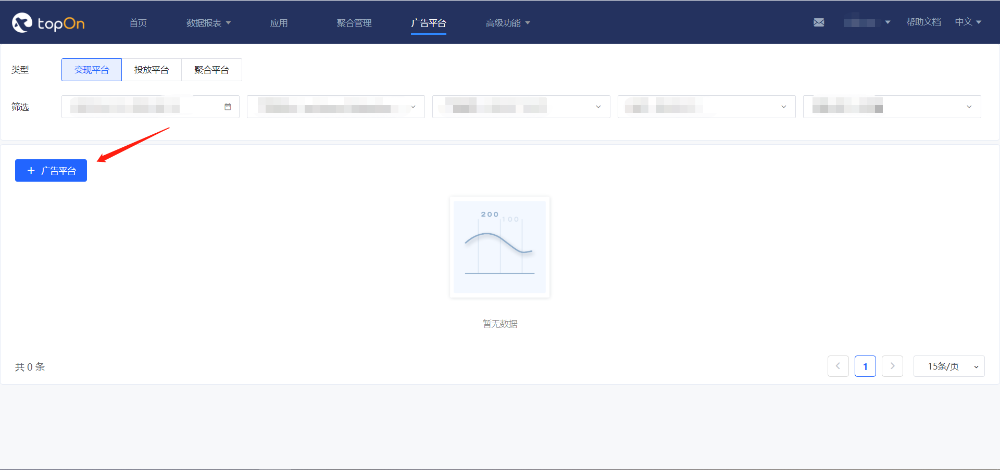
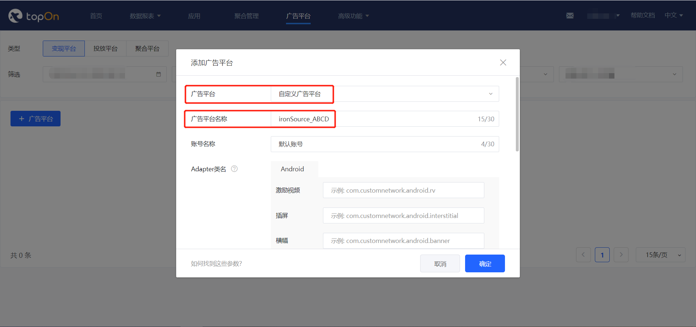
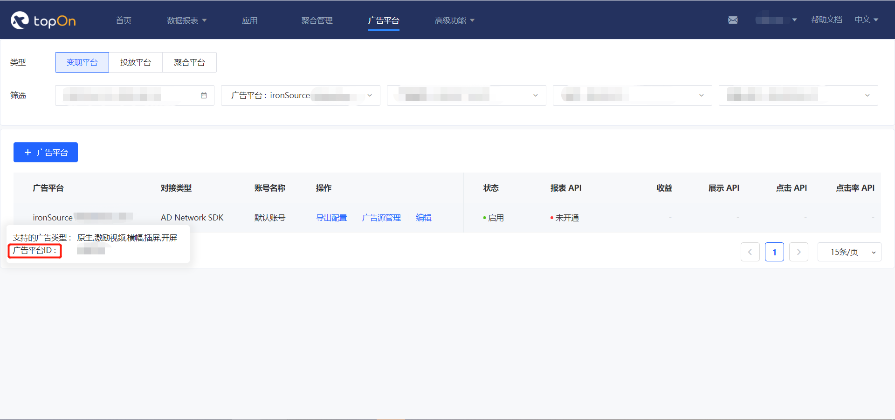
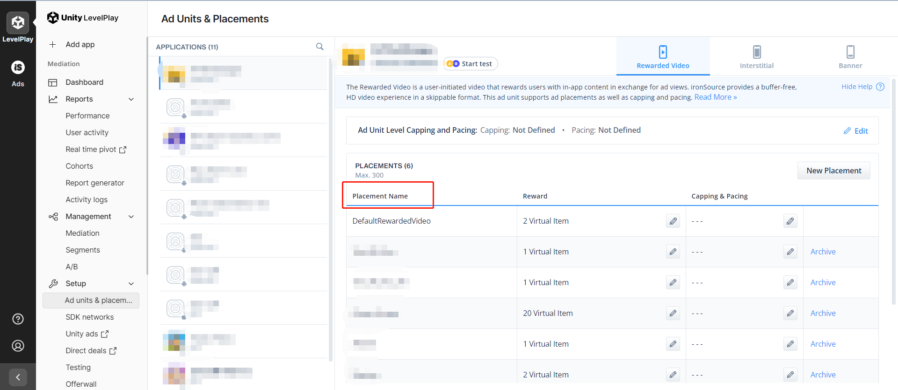
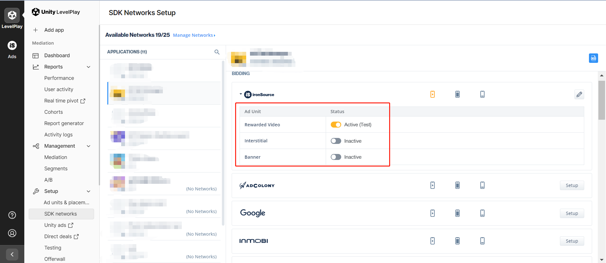
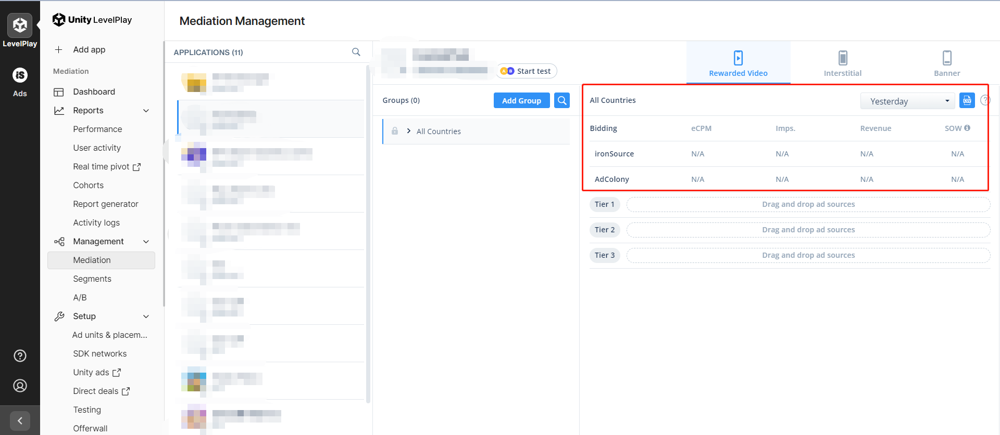

# AlexironSourceDemo_iOS

# 集成

Tip: If necessary, please refer to [the English documentation](https://github.com/Alex-only/AlexIronSourceDemo_iOS/blob/main/README_EN.md)

## 一. 接入TopOn SDK

请参考[TopOn SDK集成文档](https://docs.toponad.com/#/zh-cn/ios/GetStarted/TopOn_Get_Started)接入TopOn SDK，建议接入**TopOn v6.2.87及以上版本**


## 二. 引入Alex Adapter

1.将 ironSource 文件夹下源代码 或者 AlexironSourceSDKAdapter.framework 拖入项目中


2.Podfile 添加以下指令, 然后执行 pod install 

  pod 'IronSourceSDK','7.3.0.0'

  pod 'AnyThinkiOS','6.2.30'

3.Adapter中使用的Key说明如下：

```
"sdk_key": 广告平台的SDK Key
"unit_id": 广告平台的广告位ID
"unit_type": 广告位类型，0: Banner, 1: MREC
```

### 三. 后台配置

1、按照SDK对接文档接入同时，需要在后台添加自定义广告平台




2、选择【自定义广告平台】，填写广告平台名称、账号名称，按照SDK的对接文档填写Adapter.  
   ps:(广告平台名称需要写上ironSource，便于区分广告平台，建议名称格式：ironSource_XXXXX)




激励视频：AlexISRewardedVideoAdapter

插屏广告：AlexISInterstitialAdapter

将对应adapter的类名填入相关位置


3、记录广告平台ID



4、广告平台添加完成后，需要等待15min左右，再添加广告源（添加广告源时按照对应样式配置即可）

5、可编辑广告平台设置，选择是否开通报表api并拉取数据

6、ironSource后台的操作可以参考下面流程

创建Placement



开启应用的ironSource bidding



配置瀑布流




### 四. ironSource接入其他广告平台

如果不需要通过ironSource接入其他广告平台，可跳过此部分内容。以接入Mintegral为例：

1、先到 [TopOn后台](https://docs.toponad.com/#/zh-cn/android/download/package)，查看接入的TopOn版本兼容的Mintegral版本是多少？（TopOn v6.2.30版本兼容的Mintegral版本为v7.3.6）

2、然后到 [ironSource后台](https://dash.applovin.com/documentation/mediation/android/mediation-adapters#adapter-network-information)，根据接入的ironSource SDK版本（v7.3.0.0）和Mintegral版本（v7.3.6），查找对应的Adapter版本（即v7.3.6）

**注意：**

（1）如果找不到Mintegral v7.3.6版本对应的Adapter，可通过查看Adapter的Changelog，找到对应的Adapter版本

（2）需确保TopOn和Max都兼容Mintegral SDK


